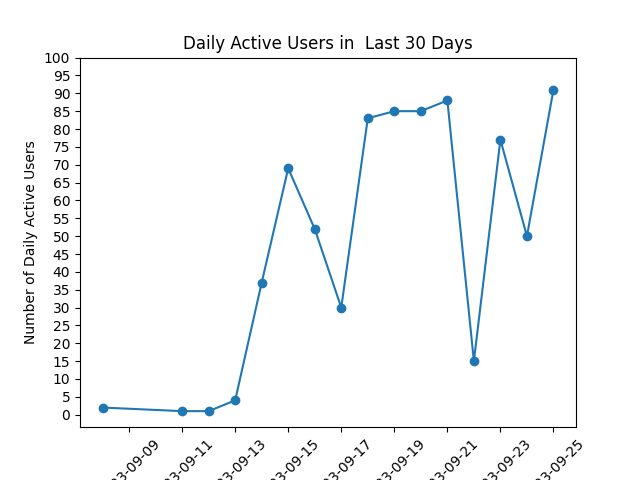
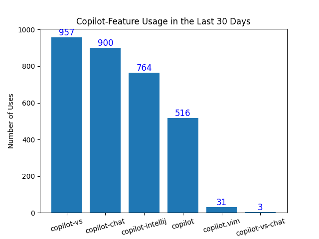

# Copilot_Activity_Usage_Report

quick report for Github Copilot for business usage in organizations.

it is a quick usage report since there is no outofbox usage report in Github Organizations.
Since there is API to get the activity, like 'https://api.github.com/orgs/{org}/copilot/billing/seats?per_page=200'
    
so by calling the API periodlly- it is 10 minutes by default in hard code now. 
We save the return as .csv, then extract it by drop dupliate/split the IDE column to more column. finally, generate report.

## Features

- support multi-organizaiton management, inlucing add/remove organization for this tool.
- This is a Flask web application that displays seat usage data for different organizations. 
The app reads organization names from a CSV file and displays them on the homepage. 
Users can select an organization and view seat usage reports and charts. 
The app also has a configuration page where new organizations can be added. 
The app runs a background thread that periodically fetches the latest seat usage data from an API.

## Installation

- pip install requirements.txt
- open app.py, run it
- then visit http://localhost:5000, select config to add your organizations.

## Usage

- Provide instructions for using your project.
- 

 Page")

 Orgs")

## Examples

- Provide examples of how to use your project.
- To check more report, please access http://localhost:5000/active_report
- To check more report, please access https://copilotreport.chinacloudsites.cn/

## API Reference

- If your project includes an API, provide documentation for the API here.
-  https://api.github.com/orgs/{org}/copilot/billing/seats?per_page=200'

## Contributing

- Provide guidelines for contributing to your project.

## License

- Provide information about the license for your project.

## Authors

- JunQian Zhuang. Daniel Wang.

## Acknowledgments

- Thank any contributors or open source projects that your project depends on.